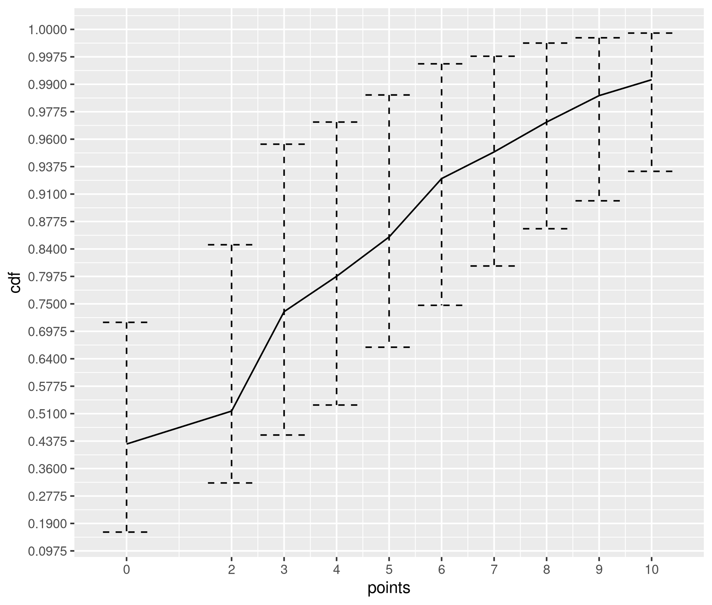

# willIpass: using EM algorithm for exam scores confidence intervals

Imagine you need to take a test. It consists of 30 questions, and mistakes in each question may cost 2, 3, 4, or 5 points (wie bei der theoretischen Führerscheinprüfung in Deutschland). And if you collect 10 or more fail points, you do not pass the test.

Say you practice your test several times, and you have collected some statistics on how many points you get.

```R
scores <- c(3,0,7,3,2,0)
```

You haven't failed a single practice test. However, what's the probability that you might fail the exam?

To answer this question, we could use the confidence interval for the Bernoulli parameter estimation:

```R
> Hmisc::binconf(sum(scores <= 10), length(scores))
 PointEst     Lower Upper
        1 0.6096657     1
```

Hmm, but the confidence interval length is quite big. After all, we have taken practice tests only 6 times. However, even after taking the practice test 50 times and never failing, the confidence interval is quite large.

```R
> Hmisc::binconf(50, 50)
 PointEst     Lower Upper
        1 0.9286524     1
```

Okay. But we haven't used all the information we have. During the practice tests, we collected the total number of points accumulated from incorrect answers. Can we utilize this information to refine our forecast for the likelihood of passing the test?

Note that we don't observe the following quantities directly

 - How many questions of each cost are there

 - Which questions did we answer wrongly, and how much did it cost

The only value we observe is the total number of points collected for each test attempt.

## EM algorithm formulation

The problem, however, lends itself to a straightforward formulation in terms of the [EM algorithm](https://en.wikipedia.org/wiki/Expectation%E2%80%93maximization_algorithm).

Say our **latent** space is 5-dimensional integer vectors
```math
Z = (z_0, z_2, z_3, z_4, z_5), \quad z_0 + \sum_{i=2}^5 z_i = 30,
```
that describes the number of questions that contributed to the accumulated cost. For example, $z_2 = 3$ means that we have answered three questions incorrectly, each costing 2 points. $z_0$ counts the number of questions answered correctly.

The **observed** total number of collected points can be computed by

```math
X = \sum_{i=2}^{5} i z_i \in \mathbb{R}
```

The latent space is then governed by the [multinomial distribution](https://en.wikipedia.org/wiki/Multinomial_distribution) with parameters $N = 30, \theta = (p_0, p_2, p_3, p_4, p_5)$.

Given a sample $X_i, i \in 1:m$, the EM-algorithm estimates $\theta$. Then, we can compute the cumulative distribution function $f(x) = P(X \leq x)$. $1-f(10)$ gives us a probability of failing the exam. Furthermore, by sampling with replacement from ${X_i}$ (bootstrap), we could derive the confidence intervals for the function $f(x)$.



The plot shows that using the results of the practice tests `c(3,0,7,3,2,0)`, the confidence interval of the probability of passing was reduced from `[0.61, 1]` (using the Bernoulli model) to `[0.93, 1]` (using the multinomial distribution model).

Consider another set of practice test results: `c(7,5,8,9,5,6)`. Although not a single practice test was failed, the probability of failing a test is lower: `[0.74, 0.9]`.

### Derivations

Let $S \coloneqq (0,2,3,4,5)$ be a vector of possible points.

Then, with the multinomial distribution with parameters $N = 30, \theta = (p_0, p_2, p_3, p_4, p_5)$, the probability of seeing vector $Z = (z_0,z_2,z_3,z_4,z_5)$ equals.
```math
    P(Z | \theta ) = \frac{N!}{z_0! z_2! \ldots z_5!} p_{0}^{z_0} p_{2}^{z_2} \ldots p_{5}^{z_5}
```

The total number of test points collected is given by:
```math
X = \langle Z, S \rangle = \sum_{i=2}^{5} i Z_i
```

Hence, given the observed sample $X_i, i \in 1:m$, the E-step function has the form
```math
\begin{gather*}
Q(\theta, \theta^{t}) = E_{Z \sim P(\cdot | X, \theta^{t})} ( \log P(X,Z | \theta ) ) \\
= \sum_{i=1}^{m} \sum_{Z: \langle Z, S \rangle = X_i} \sum_{k \in \{0,2,3,4,5\}} P(Z | \langle Z, S \rangle = X_i, \theta^t) Z_k \log p_k + C\\
= \sum_{k \in \{0,2,3,4,5\}} \alpha_{k,\theta^t} \log p_k + C
\end{gather*}
```
where
```math
\alpha_{k,\theta^t} \coloneqq \sum_{i=1}^{m} \sum_{Z: \langle Z, S \rangle = X_i} P(Z | \langle Z, S \rangle = X_i, \theta^t) Z_k
```

Starting from an initial guess $\theta^0$, we can iteratively optimize $Q(\theta, \theta^t)$ until convergence. At each step, the optimal solution is given by
```math
p^*_k = \alpha_{k, \theta^t} / \sum_{k \in \{0,2,3,4,5\}} \alpha_{k, \theta^t}
```
